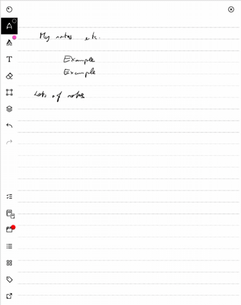
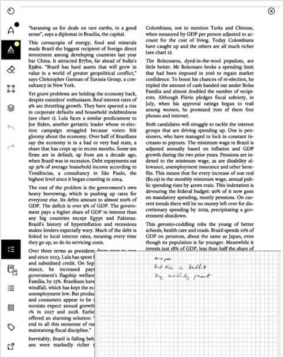
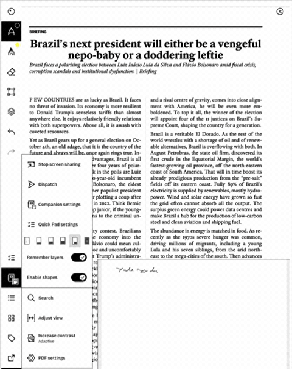

# Companion Notebook

A writable companion pane for reMarkable Paper Pro: keep your reading in view
while taking notes in a second document. Two native document views, shared pen
controls, independent scrolling, and just a thin line between the pages.
Use a lower companion for sustained reading and writing, or toggle **Quick Pad**
in a corner to capture a to-do without leaving your document.

**Experimental source release — developed on Paper Pro firmware 3.29.0.148.**
This is a working personal pilot, not a general-purpose or one-click installer.
Do not run the device-specific deployment scripts blindly or change the version
guard to force a different firmware. Back up your documents before experimenting.

## See it in use

Real Paper Pro screen recordings, in portrait. Trimmed and slightly sped up;
these show the interaction, not physical e-ink refresh speed.

### A to-do pad without leaving your notebook

Tap the task-list button, jot something down in the corner, then tuck it away.



### Keep reading with your notes beside you

Scroll the PDF independently while the corner pad stays open.



### More room for notes

A full-width companion below the PDF, with native handwriting and a thin divider.



[Download the clips as MP4](docs/images/demos/README.md) ·
[Earlier schematic mockup](docs/images/companion-overview.png)

## What it does

Two layouts share the same native writing integration:

- **Companion:** a lower pane paired with the document you are reading.
- **Quick Pad:** your chosen notebook's last page in a bottom corner, available
  across documents on this tablet. One toolbar tap opens or tucks it away.

For the ordinary companion:

- Write directly in either pane without a tap-to-select step.
- Choose a small, medium or half-height companion; medium is the default.
- Switch the companion to the main view and invert the two documents' roles.
- Pick from **Recent** or **Favorites** in a centered popup above the toolbar.
- Remember notebook/PDF pairings and stable page positions locally.
- Use the native notebook icon, with a small companion badge.

| Target | Status |
| --- | --- |
| Paper Pro, 3.29.0.148, portrait | Personal pilot; hands-on feedback ongoing |
| Other firmware, Paper Pro Move, reMarkable 2 | Not qualified; do not assume compatibility |
| Landscape, same-document dual locations | Not supported |
| Generic installer / binary release | Not available |

Inspired by [rm-hacks' split-document workflow](https://github.com/mb1986/rm-hacks/wiki/Split-Document-0.0.10).
This project uses XOVI/QMLDiff integration; it does not install old rm-hacks patches.
It is an independent project, not affiliated with reMarkable.

## Use the installed pilot

### Companion

1. Open a notebook or PDF in portrait.
2. Tap **Companion notebook** on the full toolbar, above Dates, to open or close
   the remembered companion—just like Quick Pad.
3. On first use, choose a different local portrait notebook or PDF from **Recent**
   or **Favorites**. To change it later, use **⋯ → Companion settings**
   (the overlapping-notebooks icon).
   The list scrolls; tap × or outside the popup to cancel.
4. Write directly in either pane. Only a hairline separates the pages. The native
   toolbar stays above both canvases, with shared writing-tool settings.
5. In the three-dot menu, layout pictures select source-only,
   small, medium (default), half, or companion-only. Source-only hides the
   companion without forgetting the pair. Companion-only swaps roles: the lower
   document becomes the main document, and split pictures now reveal the previous
   main document below it. No controls or labels
   sit between the pages. Split sizes are 25%, 37.5%, 50%; no fractions in the UI.
6. You can also start with a size picture: if unpaired, the picker opens directly.
   Choosing a partner creates a reverse default without replacing an existing
   pair; explicitly swapping makes the previous main document its partner.
   There is no separate menu off switch;
   the independent recovery controller remains available to the operator.

**Corner companion:** the corner-shaped
layout picture places your regular companion in a Quick Pad-sized corner,
using the same configured size and position. It keeps the paired document and
page—not your global ToDo pad—and remembers the layout for this pair. Choose
any lower-split picture to return to a full-width companion. The corner view
also hides the persistent zoom multiplier without disabling zoom gestures.
An initial revision rejected the corner transition and was rolled back; the
corrected fitting wrapper is covered by an integration regression. Current
refinements address repeated flashes and intermittent toolbar-button movement.
Unchanged warm corners retain their zoom instead of fitting again. Native e-ink
refreshes may still occur; startup checks do not establish visual acceptance.

### Quick Pad

1. Open a notebook or PDF and tap the **task-list icon** on the full toolbar.
2. On first use, choose a notebook from **Recent** or **Favorites**. This becomes
   your default pad on this tablet, independent of ordinary companion pairings.
3. Write on its **current last page**, or keep writing in the exposed source.
   Both use the same pen controls. The pad fits its width rather than shrinking
   a long page to fit its height; pinch and scroll remain available.
4. Scroll below the existing content for blank writing room. New handwriting
   extends the note through the native notebook system.
5. Tap the same toolbar icon to tuck the pad away; tap again to reopen it.

The default is a wide, short pad anchored **bottom-right**, with only thin inner
edges and no header. In **⋯ → Quick Pad settings**, choose bottom-left instead,
change the notebook, or select a size:

| Size | Width | Height |
| --- | --- | --- |
| Compact | Half | One-third |
| **Wide (default)** | Two-thirds | One-third |
| Roomy | Two-thirds | Half |

Use **Apply to current pad** to change size or corner without choosing the
notebook again. Cancel leaves your previous settings untouched.

Quick Pad uses the same secondary view as Companion: it temporarily replaces an
open lower split and restores it when closed. Otherwise, repeated toggles reuse
the loaded native pad with autosave alive. Leaving the source document or
sleeping retires it normally. The source toolbar stays in place when opening the
pad; its buttons should not disappear or jump.

The pad must be a different, available portrait notebook, not a PDF or the source
itself. Companion and Quick Pad remain usable while screen sharing; any notebook
you reveal may be visible to viewers. It does not create notebooks
or pages automatically. See [Quick Pad details and developer notes](docs/quick-pad.md).

**Current feedback:** opening now has no flash in the user's latest feedback;
writing, sizing, scrolling and toolbar behavior are working well. A large closing
flash remains. The latest refinement prevents a transient zero-height source
viewport while hiding the pad; its physical effect still needs feedback. Both
settings entries now match their toolbar icons: paired notebooks for Companion,
task list for Quick Pad. This is not a flash-free or fully qualified release.

### Safety and release boundaries

Start with a disposable notebook: mid-stroke sleep, boundary/eraser edge cases
and full extension interactions remain unqualified. A background runtime guard
restores normal apps on a reported Companion failure or a 30-second UI stall.
It is a fallback, not a guarantee against losing an in-progress stroke.
Activation is runtime-only; reboot does not automatically reactivate Companion.
Your existing app payloads, notebook files, firmware and boot configuration are
not replaced. See [the installation record](playbook/log/user_pilot_2026-09-23.md).
The native notebook icon is referenced from the tablet's own resources, not
copied into this repository. Firmware resources, device backups and binaries
are excluded. No license grant has been selected yet; public visibility alone
does not imply a permissive software license.

## For developers

Start with [design.md](design.md), [requirements](prd.org), and the
[native safety boundaries](playbook/NATIVE-GATES.md). `native/` contains the
QML host and integration snippets; `native-admission/` contains the native
input handoff module; `build-native.mjs` generates exact-firmware patches.
The `ops/` controllers are operator-specific engineering tools, **not install
instructions**. They depend on private firmware caches, previously prepared
artifacts, pinned device identities and the surrounding extension inventory.

Local UI/orchestration checks (Node plus Qt Quick/Qt Test):

```sh
node --test tests/pilot-layout.test.cjs
node tests/pilot-menu.mjs
node tests/pilot-picker.mjs
```

For the opt-in Quick Pad build and its composition, geometry, settings and
warm-toggle regressions, follow [the Quick Pad test commands](docs/quick-pad.md#offline-build-and-tests).
Composition checks require the private exact-firmware cache and local base-app
inventory; this public repository intentionally does not include those resources.

These tests do not connect to a tablet or establish native handwriting safety.
There is no promise that the historical full test suite describes today's UI:
some tests intentionally retain prior prototype/diagnostic contracts.

Useful feedback: pane ownership and navigation, picker ergonomics, reproducible
firmware compatibility observations, and recovery design. Please include model,
exact firmware and relevant redacted logs; never upload personal notebooks or keys.

## Qualification history (before the hands-on pilot)

<details>
<summary>Historical engineering notes and local diagnostic commands (not installation steps)</summary>

The tap-only size ruler is implemented; the filled mark shows the selected
size. There is no drag interaction. A real native **during-stroke handoff and
resize now passes**, including all four correctly saved strokes. The regular
pair/resize/tuck/reveal controls also passed a bounded native submission test;
saved-file readback subsequently passed. Native page/tool/close and already-parked
display sleep also passed; broader edge cases remain outstanding. See the bounded
[handoff audit](playbook/ADMISSION-HANDOFF.md). This project is not ready for daily
use as a fully qualified release or inclusion in the recurring installation list.

Latest result (2026-09-23): corrected ordinary-control trial20260923T052500Z-1
passed native pair/resize/tuck/reveal/cancel and four stroke submissions. Its
watchdog reported restoration of the accepted Pro setup; connectivity was lost
before the separate full postcheck and saved-file copy. Those remain pending, not
passed. Newer local page/tool safeguards pass regression tests but are not yet
native-qualified or installed. See [the controls receipt](playbook/log/ordinary_controls_2026-09-23.md)
and the earlier [verified native saved-ink pass](playbook/log/admission_bootstrap_pass_2026-09-23.md).

| Capability | Evidence |
| --- | --- |
| Two distinct native views, independent controllers | Passed bounded on-device structural test |
| Reach page edges in both exposed panes at unchanged scale | Passed on-device geometry test |
| Write in either pane without selecting it first | Passed on-device fixed-layout test |
| Native saving of those two strokes | Both exact disposable files contained their expected shapes after UI restart |
| Move the sheet, then continue writing | Native four-stroke write–retire–move–recreate–write sequence completed; final controller observation timed out and restored base |
| Native saving before and after movement | All four saved shapes matched their pane/round and reconstructed native bounds exactly |
| Cold startup and during-stroke sealed resize | Full native admission trial and saved-shape readback passed; normal base restored |
| Fixed ⅓ / ½ / ⅔ ruler, per-pair selection, no accidental drag | Local pointer/state tests pass; native actual-control trial started at⅓ and wrote at½/⅔; saved readback pending |
| Pair, resize, tuck/reveal and chooser cancellation | Actual native host/control trial passed; normal setup restoration reported |
| Native reopen and settled visual occlusion at ½ and ⅔ | Saved pages render correctly in guarded native-buffer captures; normal setup restored |
| Dynamic pen-boundary clipping and user-triggered lifecycle | Not yet qualified |

The historical Qt capture diagnostic crashed the native e-ink rendering path and
remains blocked. No capture/layer workaround is part of the new experiment. See
[ink scope](playbook/INK-QUALIFICATION.md) and the
[retirement diagnostic](playbook/RETIREMENT-PROBE.md) before any further device use.

## Run locally

With Node and Qt Quick/Qt Test installed:

```sh
node build-native.mjs
CN_PROBE=render node build-native.mjs # local diagnostic-driver tests only
CN_PROBE=structural node build-native.mjs
CN_PROBE=geometry node build-native.mjs # offline only; its one-run review is consumed
CN_PROBE=ink node build-native.mjs # builds disposable diagnostic only, does not deploy
aarch64-linux-gnu-gcc -std=c11 -Wall -Wextra -Werror -O2 -static -o build/ink-native/ink-events ops/ink-events.c
CN_PROBE=ink node ops/build-render-controller.mjs
CN_PROBE=visual node build-native.mjs # local-only saved-note reopen candidate
node ops/build-visual-controller.mjs # requires the frozen structural controller
npm test
QT_QPA_PLATFORM=offscreen QT_QUICK_BACKEND=software qmltestrunner -import tests/mock-imports -input tests
QT_QUICK_CONTROLS_STYLE=Basic qml ui/Main.qml
```

On this Mac the executables are in `/opt/homebrew/bin`. Restricted sandboxes
may prevent Qt CPU-feature detection; use a normal local terminal if it reports
missing NEON. Desktop tests currently use Qt 6.8.2, not the tablet's 6.10.3.

Tap a ruler mark to choose ⅓, ½ or ⅔; the underlying page never shrinks. Write directly
in either pane; use a trackpad/wheel or flick to scroll. Tuck/Reveal preserves
positions. “Simulate pen” tests ownership with the mouse, not real handwriting:
the first press immediately writes in the touched pane. Demo marks are ephemeral.
The prototype uses synthetic documents, makes no network calls, and reads no
notebooks. Demo pairings live only for the process lifetime. Native boundary tests
exercise the separate host through mocked document controllers and temporary
local settings files; they are not native-device acceptance tests.

## Native candidate

`build-native.mjs` requires the private exact-firmware cache and pinned QMLDiff
tool (override their locations with `RM_FIRMWARE` and `QMLDIFF_BIN`). It emits
`build/native/companion-notebook.qmd`, `NativeHost.qml`, `PairStore.js`, `SizeRuler.qml` and a hash
manifest. It never connects to a device. Firmware resources stay outside this
repository and are not redistributed.

`npm run test:composition` applies the candidate to the locally coordinated
base-plugin inventory in three orders. Paths and hashes are deliberately pinned
to this qualification session, not a generic installation promise. A future
firmware requires a new review, not merely changing a version string.

`CN_PROBE=render` builds the blocked historical diagnostic profile under
`build/render-native`, not the normal host. It creates two labeled test notebooks
through native APIs, never draws ink, and attempts to restore the prior view. It
must not be deployed again; it is retained only for local regression tests.
`CN_PROBE=structural` emits `build/structural-native`, with capture removed and a
distinct structural-only completion result. It requires its own reviewed bounded
controller, never ordinary app installation. The normal build has no automatic
notebook-creation code. Neither diagnostic proves visual or pen correctness.
The `geometry` profile additionally tests exposed-pane navigation and input mapping
after native loading settles. Its successful on-device receipt is in the
[direct-write log](playbook/log/direct_write_2026-09-22.md). Staging refuses any
repeat until a separately reviewed need exists; rebuilding is not deployment clearance.

The `ink` profile is a separate fixed-layout diagnostic, not an installation
option. It admits only two exact freshly-created native notebooks, without a
select-only pen tap. A bounded native marker helper and independent always-revert
controller protect recovery. Native submission and saved-file verification are
separate receipts; neither proves fluidity or qualifies a personal release.

The `retirement` profile adds a small public-Qt observer and a factory around the
existing native handler. It submits two different fixed strokes per disposable
note, with a real native destruction acknowledgement and live sheet movement
between them. The normal host and historical reviewed ink bytes are unchanged.
The module has a standalone import test that needs no UI restart or input access;
actual target loading must pass before the UI diagnostic. These are qualification
tools, not an installer. Build/review details are in the retirement playbook.
The actual standalone import and native retirement sequence have now run. All
four saved shapes passed verification against the native tool/thickness-padded
rectangle semantics, but the whole-trial pass marker was not reached before
automatic restoration. Its one-run staging
clearance is consumed; do not rerun an old capsule.

The newer admission sidecar builds with `node ops/build-admission-cross.mjs`.
`node ops/stage-bootstrap-smoke.mjs YYYYMMDD-N` only prepares a fresh **local**
fake-process capsule; it does not connect or authorize deployment. Its operator
must use the separate bounded process group described in the fix receipt.
`node ops/build-admission-controller.mjs` emits a distinct
`build/admission-bootstrap-native` candidate without overwriting the consumed
combined-preload controller. The existing admission stager stays blocked.

The native host keeps primary-document scale unchanged, uses a distinct native
DocumentView for a recent local companion, and persists only pairing metadata
through Qt settings. Notebook writes remain exclusively native. Read
[the ordered native gates](playbook/NATIVE-GATES.md) before any device trial.

Historical diagnostics use the checksum-pinned `native/DiagnosticHost.qml`.
Their payloads remain reproducible independently of the ordinary ruler UI.
The old load-probe packaging is blocked for the revised normal payload: its
controller does not yet install the added ruler file. A new reviewed capsule
must account for the complete file inventory; rebuilding is not deployment.

</details>

## Why a separate project?

This app should have its own UI, state model and firmware-specific integration,
not be bundled into the inert Beta OS marker or the full rm-hacks collection.
No upstream code is copied into this prototype. No license grant is declared yet.

- [Requirements and next steps](prd.org)
- [Architecture and main functions](design.md)
- [Native qualification gates](playbook/NATIVE-GATES.md)
- [Implementation record](playbook/log/changelog_prototype_2026-09-21.md)

**Do not install the desktop canvas on a tablet.** The eventual app must route
through native document/pen controllers; it must not write notebook files itself.
